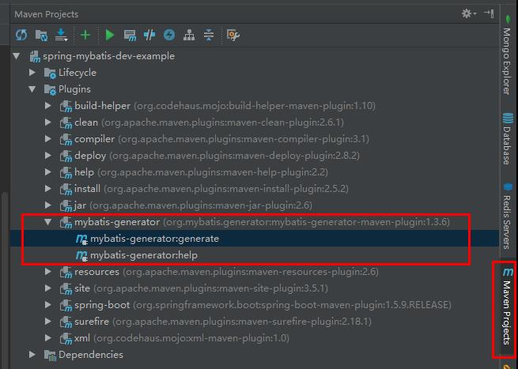
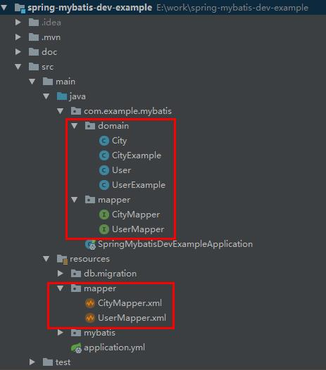

# spring-mybatis-dev-example

项目展示Spring Boot With Mybatis 的基本使用, 存在细节上的注意事项。

## 项目组件

### Spring Session

使用Spring Session 做JDBC的Session存储, 极大程度的优化大量连接下Session的内存占用。使用方法也十分方便简单。
仅需引入相关依赖，并加入配置即可。
pom.xml 需要加入依赖项
```xml
    <dependency>
        <groupId>org.springframework.session</groupId>
        <artifactId>spring-session</artifactId>
    </dependency>
```
 并且在 application.yml 配置中需要加入配置
 ```yaml
spring:
  session:
    store-type: jdbc
```
之后AutoConfig工具会自动创建数据库表等。

### Flyway 数据库迁移工具

pom.xml 依赖

```xml
        <dependency>
            <groupId>org.flywaydb</groupId>
            <artifactId>flyway-core</artifactId>
            <version>4.1.2</version>
        </dependency>
```
 application.yml 配置
 ```yaml
flyway:
    enabled: true # Enable flyway.
    locations: classpath:db/migration # locations of migrations scripts
    sql-migration-prefix: V #
    sql-migration-suffix: .sql #
    validate-on-migrate: true
    baseline-on-migrate: true
```
db/migration 下存放SQL脚本, 需要注意的是脚本的命名规范, 以及递增式的表结构操作。
命名规范：V(number)_(number)__name[_time].sql

## Spring Boot with Mybatis 配置说明

### Mybatis Generator

在项目中使用了 mybatis-generator-maven-plugin 方便自动生成基础操作的DAO代码。使用时需要配置
pom.xml 以及mybatis-generator插件需要的一个生成规范的配置文件。由于使用了Mysql数据库因此在插件中
引入了Mysql依赖。pom.xml 如下:
```xml
<plugin>
     <groupId>org.mybatis.generator</groupId>
     <artifactId>mybatis-generator-maven-plugin</artifactId>
     <version>1.3.6</version>
     <configuration>
         <configurationFile>src/main/resources/mybatis/generator.xml
         </configurationFile>
         <verbose>true</verbose>
         <overwrite>true</overwrite>
     </configuration>
     <executions>
         <execution>
             <id>Generate MyBatis Artifacts</id>
             <goals>
                 <goal>generate</goal>
             </goals>
         </execution>
     </executions>
     <dependencies>
         <dependency>
             <groupId>org.mybatis.generator</groupId>
             <artifactId>mybatis-generator-core</artifactId>
             <version>1.3.6</version>
         </dependency>
         <dependency>
             <groupId>mysql</groupId>
             <artifactId>mysql-connector-java</artifactId>
             <version>5.1.44</version>
         </dependency>
     </dependencies>
 </plugin>
```
加入插件配置应该在Maven命令中找到新的操作, idea 工具中的表现如下图：


值得详细注意的内容是resources/mybatis/generator.xml, 这个文件是mybatis-generator的配置文件详细说明了
文件该如何生成以及生成规范等。generator.xml 如下：
```xml
<generatorConfiguration>

    <!--<classPathEntry location=""/>-->

    <context id="context" targetRuntime="MyBatis3">
        <commentGenerator>
            <property name="suppressAllComments" value="true"/>
            <property name="suppressDate" value="true"/>
        </commentGenerator>

        <!--数据源配置-->
        <jdbcConnection
                userId="root"
                password="root"
                driverClass="com.mysql.jdbc.Driver"
                connectionURL="jdbc:mysql://localhost:3306/mybatis"/>

        <javaTypeResolver>
            <property name="forceBigDecimals" value="true"/>
        </javaTypeResolver>

        <!--Maven 执行目录是项目根目录, 因此基于项目根目录往下配置-->
        <!-- 配置ModelClass的生成地址以及一些定制需求-->
        <javaModelGenerator targetPackage="com.example.mybatis.domain" targetProject="src/main/java">
            <property name="enableSubPackages" value="false"/>
            <property name="trimStrings" value="true"/>
        </javaModelGenerator>

        <!-- 配置sql xml的生成地址-->
        <sqlMapGenerator targetPackage="mapper" targetProject="src/main/resources">
            <property name="enableSubPackages" value="false"/>
        </sqlMapGenerator>

        <!-- 配置sql xml的生成类型等-->
        <javaClientGenerator targetPackage="com.example.mybatis.mapper" type="XMLMAPPER" targetProject="src/main/java">
            <property name="enableSubPackages" value="false"/>
        </javaClientGenerator>

        <!--需要生成的表配置 schema TableName-->
        <table schema="mybatis" tableName="user" enableCountByExample="true" enableDeleteByExample="true"
               enableSelectByExample="true" enableUpdateByExample="true"/>

        <table schema="mybatis" tableName="city" enableCountByExample="true" enableDeleteByExample="true"
               enableSelectByExample="true" enableUpdateByExample="true"/>
    </context>
</generatorConfiguration>
```
这些配置完成之后, 通过Maven命令可以生成相关model, mapper以及绑定的sql及xml文件

异常就可以正常生成我们需要的BaseDAO Code了。

### 集成Spring Boot 

虽然按照Mybatis Generator生成了代码, 但是在环境中还无法直接将xxxMapper直接注入给@Service或其他@Component
直接使用, 但是想要正常集成到Spring Boot中也是比较简单。第一、可以使用多重XML配置文件来控制逻辑；第二可以使用
application.yml和注释配合的方式。这里介绍本项目中采用的第二种方式。首先我们需要给Mybatis指定我们的Mapper.xml
的位置, 具体方式是
首先，在application.yml中加入配置。
```yaml
mybatis:
  mapper-locations: classpath:mapper/*.xml
```
mapper-locations直接指向我们的mapper.xml所在目录下所有mapper.xml
然后再所有的XxxMapper接口代码中加入@Mapper注释, 像下面这样
```java
@Mapper
public interface CityMapper {
}
```
## 总结
主要是Mybatis Generator生成的代码要和SpringBoot结合起来需要特殊处理, 以及一些配置细节需要注意。